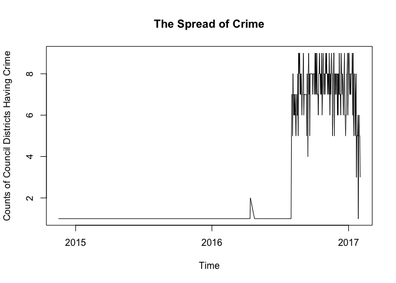

Home Work-9
================
Vincent, Gins, Lilik
March 20, 2017

Data file
---------

Read file "ArrestMini.csv" and save it to "ArrestMini"

``` r
ArrestMini <- read.csv("ArrestMini.csv")
```

"DataCleaning.R" inside the "Function" folder
---------------------------------------------

``` r
AggregateByCase<-function(group,x){tapply(x,group,length)}
lenunique<-function(x){length(unique(x))}
UniqueAggregate<-function(group,x){tapply(x,group,lenunique)}
```

"Plotting.R" inside "Graphs" folder
-----------------------------------

``` r
PlotByTime<-function(time,count){ plot(count~time,
                                  xlab="Time",ylab="Counts of Council Districts Having Crime",
                                  main="The Spread of Crime",type="l",lwd=1)}
```

"main.R" that contains the functions in both DataCleaning.R and Plotting.R
--------------------------------------------------------------------------

Read ArrestMini.csv and save it to ArrestMini

``` r
ArrestMini <- read.csv("ArrestMini.csv")
```

    ##            ARRESTTIME COUNCIL_DISTRICT
    ## 1 2016-09-12T22:53:00                1
    ## 2 2016-12-26T20:36:00                7
    ## 3 2016-12-27T15:19:00                4
    ## 4 2017-01-04T20:09:00                1
    ## 5 2017-01-07T22:28:00                6
    ## 6 2016-09-18T13:55:00                6

Ommit NA

``` r
dat<-na.omit(ArrestMini)
```

Retrieve the "date character" from "ARRESTTIME" character string that contains date dan time

``` r
dat$ARRESTTIME<-substr(as.character(dat$ARRESTTIME), 1, 10)
```

result (display only 20 list):

    ##  [1] "2016-09-12" "2016-12-26" "2016-12-27" "2017-01-04" "2017-01-07"
    ##  [6] "2016-09-18" "2016-09-19" "2016-09-19" "2016-11-08" "2016-10-08"
    ## [11] "2016-11-14" "2017-01-05" "2016-11-09" "2017-01-07" "2016-09-15"
    ## [16] "2016-11-07" "2016-11-28" "2016-10-07" "2016-10-07" "2017-01-10"

Count the aggregate Council Districts on each Arrest Time day

``` r
CrimeCount<-as.matrix(AggregateByCase(dat$ARRESTTIME,dat$COUNCIL_DISTRICT))
```

result (display 20 list):

    ## 2014-11-16 2015-05-29 2015-11-04 2016-02-12 2016-02-17 2016-03-03 
    ##          3          1          2          1          1          1 
    ## 2016-04-04 2016-04-08 2016-04-10 2016-04-12 2016-04-13 2016-04-24 
    ##          1          1          1          2          4          1 
    ## 2016-04-28 2016-06-17 2016-07-02 2016-07-07 2016-07-09 2016-07-11 
    ##          1          1          1          2          1          1 
    ## 2016-07-14 2016-07-16 
    ##          1          1

Count the aggregate unique Council Districts on each Arrest Time day

``` r
CouncilCount<-as.matrix(UniqueAggregate(dat$ARRESTTIME,dat$COUNCIL_DISTRICT))
```

result:

    ##            [,1]
    ## 2014-11-16    1
    ## 2015-05-29    1
    ## 2015-11-04    1
    ## 2016-02-12    1
    ## 2016-02-17    1
    ## 2016-03-03    1
    ## 2016-04-04    1
    ## 2016-04-08    1
    ## 2016-04-10    1
    ## 2016-04-12    1
    ## 2016-04-13    2
    ## 2016-04-24    1
    ## 2016-04-28    1
    ## 2016-06-17    1
    ## 2016-07-02    1
    ## 2016-07-07    1
    ## 2016-07-09    1
    ## 2016-07-11    1
    ## 2016-07-14    1
    ## 2016-07-16    1
    ## 2016-07-18    1
    ## 2016-07-20    1
    ## 2016-07-22    1
    ## 2016-07-25    1
    ## 2016-07-26    1
    ## 2016-07-29    1
    ## 2016-07-31    1
    ## 2016-08-01    5
    ## 2016-08-02    7
    ## 2016-08-03    7
    ## 2016-08-04    5
    ## 2016-08-05    8
    ## 2016-08-06    7
    ## 2016-08-07    6
    ## 2016-08-08    7
    ## 2016-08-09    6
    ## 2016-08-10    6
    ## 2016-08-11    7
    ## 2016-08-12    6
    ## 2016-08-13    5
    ## 2016-08-14    6
    ## 2016-08-15    7
    ## 2016-08-16    6
    ## 2016-08-17    6
    ## 2016-08-18    8
    ## 2016-08-19    5
    ## 2016-08-20    9
    ## 2016-08-21    9
    ## 2016-08-22    8
    ## 2016-08-23    9
    ## 2016-08-24    7
    ## 2016-08-25    8
    ## 2016-08-26    7
    ## 2016-08-27    8
    ## 2016-08-28    7
    ## 2016-08-29    6
    ## 2016-08-30    7
    ## 2016-08-31    7
    ## 2016-09-01    8
    ## 2016-09-02    9
    ## 2016-09-03    6
    ## 2016-09-04    7
    ## 2016-09-05    7
    ## 2016-09-06    7
    ## 2016-09-07    7
    ## 2016-09-08    7
    ## 2016-09-09    7
    ## 2016-09-10    7
    ## 2016-09-11    5
    ## 2016-09-12    8
    ## 2016-09-13    7
    ## 2016-09-14    4
    ## 2016-09-15    8
    ## 2016-09-16    9
    ## 2016-09-17    7
    ## 2016-09-18    8
    ## 2016-09-19    5
    ## 2016-09-20    8
    ## 2016-09-21    8
    ## 2016-09-22    8
    ## 2016-09-23    8
    ## 2016-09-24    8
    ## 2016-09-25    8
    ## 2016-09-26    8
    ## 2016-09-27    7
    ## 2016-09-28    8
    ## 2016-09-29    8
    ## 2016-09-30    8
    ## 2016-10-01    8
    ## 2016-10-02    7
    ## 2016-10-03    9
    ## 2016-10-04    7
    ## 2016-10-05    9
    ## 2016-10-06    8
    ## 2016-10-07    7
    ## 2016-10-08    9
    ## 2016-10-09    7
    ## 2016-10-10    7
    ## 2016-10-11    7
    ## 2016-10-12    6
    ## 2016-10-13    8
    ## 2016-10-14    8
    ## 2016-10-15    9
    ## 2016-10-16    8
    ## 2016-10-17    8
    ## 2016-10-18    7
    ## 2016-10-19    8
    ## 2016-10-20    7
    ## 2016-10-21    9
    ## 2016-10-22    6
    ## 2016-10-23    7
    ## 2016-10-24    8
    ## 2016-10-25    9
    ## 2016-10-26    8
    ## 2016-10-27    7
    ## 2016-10-28    8
    ## 2016-10-29    8
    ## 2016-10-30    7
    ## 2016-10-31    8
    ## 2016-11-01    9
    ## 2016-11-02    8
    ## 2016-11-03    9
    ## 2016-11-04    8
    ## 2016-11-05    8
    ## 2016-11-06    7
    ## 2016-11-07    8
    ## 2016-11-08    8
    ## 2016-11-09    7
    ## 2016-11-10    9
    ## 2016-11-11    8
    ## 2016-11-12    6
    ## 2016-11-13    8
    ## 2016-11-14    7
    ## 2016-11-15    8
    ## 2016-11-16    9
    ## 2016-11-17    8
    ## 2016-11-18    8
    ## 2016-11-19    5
    ## 2016-11-20    6
    ## 2016-11-21    8
    ## 2016-11-22    9
    ## 2016-11-23    9
    ## 2016-11-24    5
    ## 2016-11-25    8
    ## 2016-11-26    7
    ## 2016-11-27    8
    ## 2016-11-28    8
    ## 2016-11-29    7
    ## 2016-11-30    8
    ## 2016-12-01    8
    ## 2016-12-02    6
    ## 2016-12-03    8
    ## 2016-12-04    6
    ## 2016-12-05    8
    ## 2016-12-06    7
    ## 2016-12-07    9
    ## 2016-12-08    7
    ## 2016-12-09    7
    ## 2016-12-10    7
    ## 2016-12-11    6
    ## 2016-12-12    9
    ## 2016-12-13    8
    ## 2016-12-14    8
    ## 2016-12-15    7
    ## 2016-12-16    8
    ## 2016-12-17    7
    ## 2016-12-18    6
    ## 2016-12-19    7
    ## 2016-12-20    8
    ## 2016-12-21    9
    ## 2016-12-22    6
    ## 2016-12-23    6
    ## 2016-12-24    5
    ## 2016-12-25    6
    ## 2016-12-26    6
    ## 2016-12-27    8
    ## 2016-12-28    8
    ## 2016-12-29    9
    ## 2016-12-30    6
    ## 2016-12-31    7
    ## 2017-01-01    9
    ## 2017-01-02    9
    ## 2017-01-03    8
    ## 2017-01-04    7
    ## 2017-01-05    8
    ## 2017-01-06    7
    ## 2017-01-07    7
    ## 2017-01-08    8
    ## 2017-01-09    8
    ## 2017-01-10    8
    ## 2017-01-11    9
    ## 2017-01-12    6
    ## 2017-01-13    9
    ## 2017-01-14    6
    ## 2017-01-15    5
    ## 2017-01-16    8
    ## 2017-01-17    8
    ## 2017-01-18    7
    ## 2017-01-19    5
    ## 2017-01-20    7
    ## 2017-01-21    8
    ## 2017-01-22    3
    ## 2017-01-23    5
    ## 2017-01-24    5
    ## 2017-01-25    5
    ## 2017-01-26    6
    ## 2017-01-27    1
    ## 2017-01-28    5
    ## 2017-01-29    6
    ## 2017-01-30    5
    ## 2017-01-31    5
    ## 2017-02-01    3

A "Time-Series" Graph
---------------------

Convert variable ARRESTTIME from character to date

``` r
time<-as.Date(sort(unique(dat$ARRESTTIME)),"%Y-%m-%d")
```

Plot time and aggregate Council Districts on each Arrest Time day

``` r
PlotByTime(time,CouncilCount[,1])
```



Thank You.....
==============
